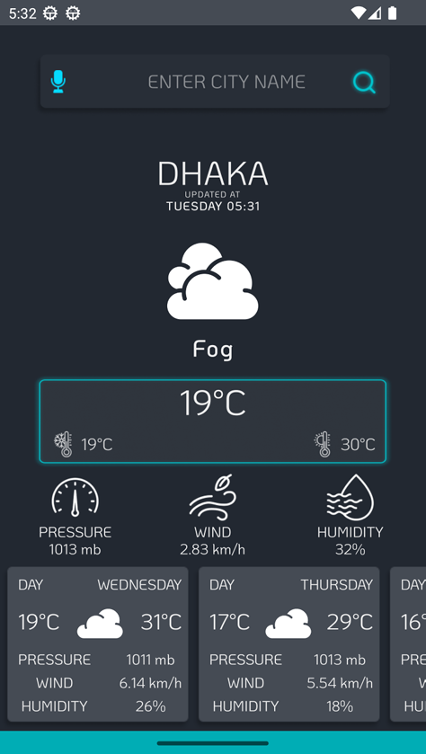
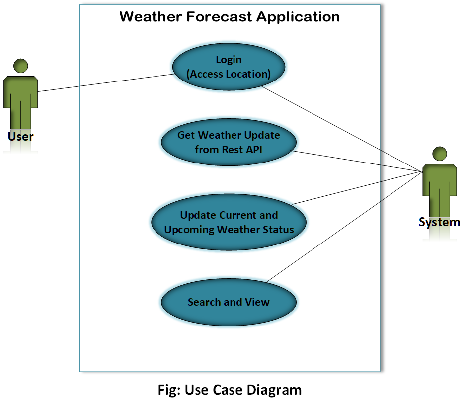
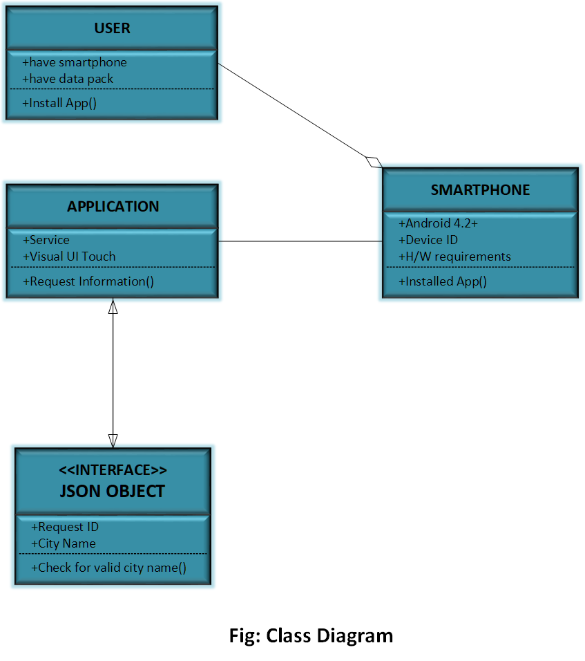
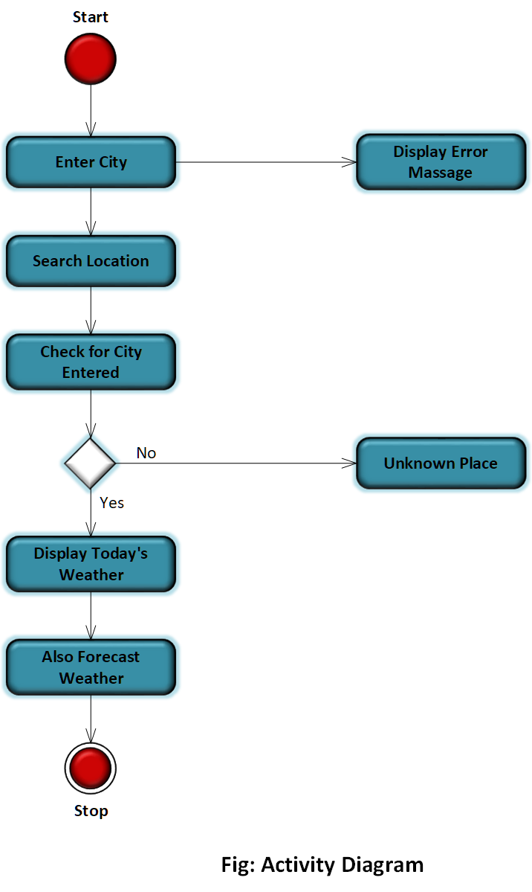

# Weather Forecast Android App

An intuitive and lightweight weather forecasting application built in Android Studio using Java. Designed with simplicity and accessibility in mind, this app helps users quickly access current weather data with just one click.


<p align="center">
  
</p>


## Features

- **Location-Based Forecast**: Automatically fetches current weather details based on user's GPS location.
- **Live Weather Data**: Displays temperature, humidity, pressure, wind speed, and rain probability.
- **Simple UI**: Clean and minimal interface, suitable for all age groups and digital literacy levels.
- **Lightweight**: Small APK size and fast performance on most Android devices.
- **Updated Information**: Weather data refreshes every four hours using OpenWeatherMap API.

## Technologies Used

- **Android Studio** – Java-based development environment.
- **OpenWeatherMap API** – For real-time weather data.
- **Gson Library** – JSON parsing for API response.
- **Picasso Library** – Efficient image loading.
- **GPS Location Services** – For determining user's position.
- **AsyncTask** – For handling background data fetching.


## Architecture

- **Client-Server Model** using RESTful web services.
- **SOA (Service-Oriented Architecture)**: Lightweight client (Android app) communicates with external API via HTTP and JSON.
- **Haversine Formula**: Used to calculate distance between user and nearest weather station.

<p align="center">
  
  
  
</p>

## Testing & Validation

- **Unit Testing**
- **Integration Testing**
- **System Testing**
- **User Acceptance Testing**

All modules were verified for both accuracy and performance. Edge cases like invalid city inputs and no GPS signal were handled gracefully.

## Limitations & Future Scope

### Known Limitations
- Limited data due to use of free-tier OpenWeatherMap API.
- Some location-specific forecasts may be imprecise.

### Future Enhancements
- Multilingual Support.
- Integration of AI for predictive accuracy and travel tips.
- User notification system for weather alerts.
- Personalized travel assistant based on route and conditions.

## Demonstration Video
[OneDrive](https://1drv.ms/v/c/ff1167d5fb2bbfdb/EVvuCp8NmV9FhTP2wyEaRKUBzh1TnzndSvdBv1_4Eziz2A?e=EiQbBm)

[Weiyun Share](https://share.weiyun.com/Y2JIVzYC)


## Installation & Setup

1. Clone the repository:
   ```bash
   git clone https://github.com/RaohaMejba/weather-forecast-app.git

2. Open in Android Studio.

3. Add your OpenWeatherMap API key in Common.java.

4. Run the app on an emulator or physical device with GPS and internet access.


## Contact
**Raoha Bin Mejba**
**Email:** raoha77outlook.com


## References
[OpenWeatherMap API](https://openweathermap.org/city/2643743)

[Android Developers](https://developer.android.com/)

[Gson Library](https://github.com/google/gson)

[Picasso Library](https://square.github.io/picasso/)

[Android Architecture Overview](https://source.android.com/)
